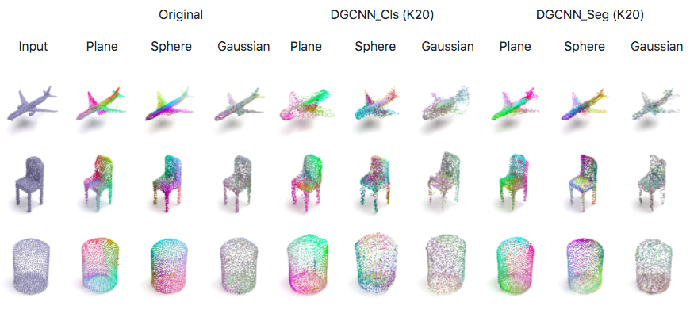
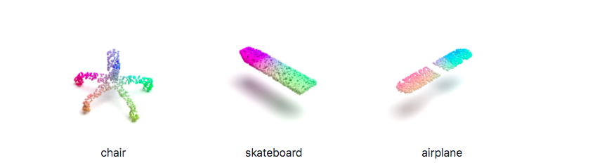

# Point Cloud Feature Learning

This repo aims to provide experiments and codes on point cloud feature learning.

### Contents

- [Unsupervised Point Cloud Reconstruction for Classific Feature Learning](#unsupervised-point-cloud-reconstruction-for-classific-feature-learning)
- [Point Cloud Segmentation for Classific Feature Learning](#point-cloud-segmentation-for-classific-feature-learning)
- coming soon

&nbsp;
## Unsupervised Point Cloud Reconstruction for Classific Feature Learning

    

Can unsupervised point cloud reconstruction extract features suitable for classification?

This work aims to show whether learning a unsupervised point cloud reconstruction task, for example [FoldingNet](https://arxiv.org/abs/1712.07262), is able to extract features performing well in classification. We do all experiments under the framework of FoldingNet.

**The key contributions of this work are as follows:**

- We provide a pytorch reimplementation for FoldingNet.
- We also use source points for decoder from sphere surface and gaussian distribution. Results show that source points from sphere surface can reconstruct better.
- We do experiments using [DGCNN](https://arxiv.xilesou.top/pdf/1801.07829) as encoder and provide the classification performance for linear SVM classifier. The transfer dataset performance is better than the state-of-the-art unsupervised methods. We also train our best unsupervised model supervisedly, our unsupervised results still win out.  
- We illustrate that better reconstruction results do not correspond with better feature for classfication. 

See [this](https://github.com/AnTao97/UnsupervisedPointCloudReconstruction) for details.

&nbsp;
## Point Cloud Segmentation for Classific Feature Learning

    

This work aims to show whether learning a point cloud segmentation task is able to extract features performing well in classification. We do all experiments under the framework of [DGCNN](https://arxiv.xilesou.top/pdf/1801.07829).

We also do experiments to see whether learning segmentation on meaningful point clouds assembled by some base point clouds can help to learning better features for base point clouds.

**The key contributions of this work are as follows:**

- Since the network provided by DGCNN for segmentation is supervised, we provide an revised DGCNN segmentation network with no category label.
- When segmentation is trained and tested on intact point clouds, the trained model can help to extract better features.
- When segmentation is trained on intact point clouds and tested on base point clouds, the trained model also can help to extract better features. 

See [this](https://github.com/AnTao97/PointCloudSegmentation) for details.
